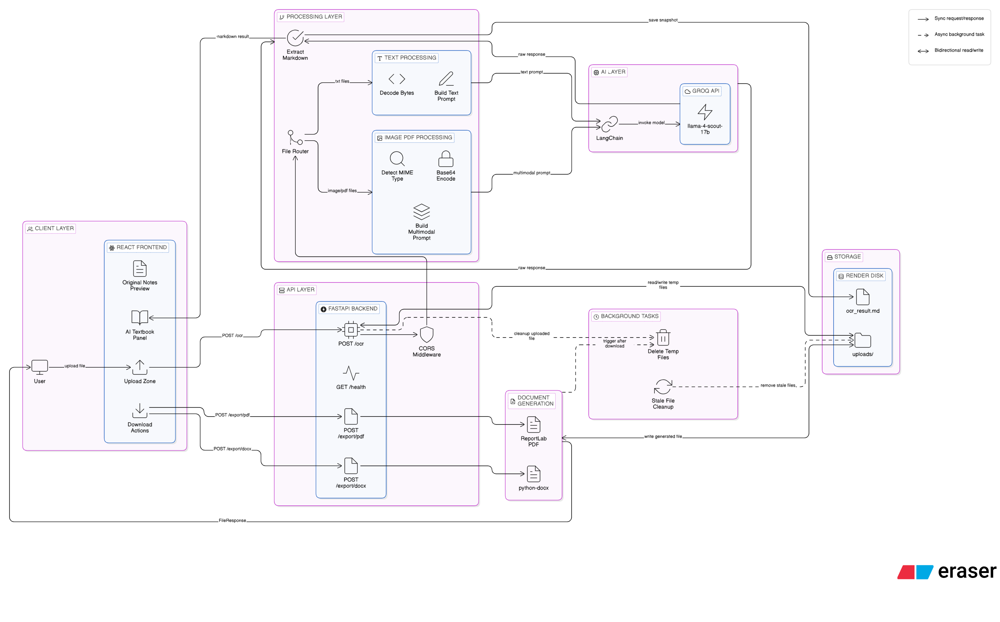
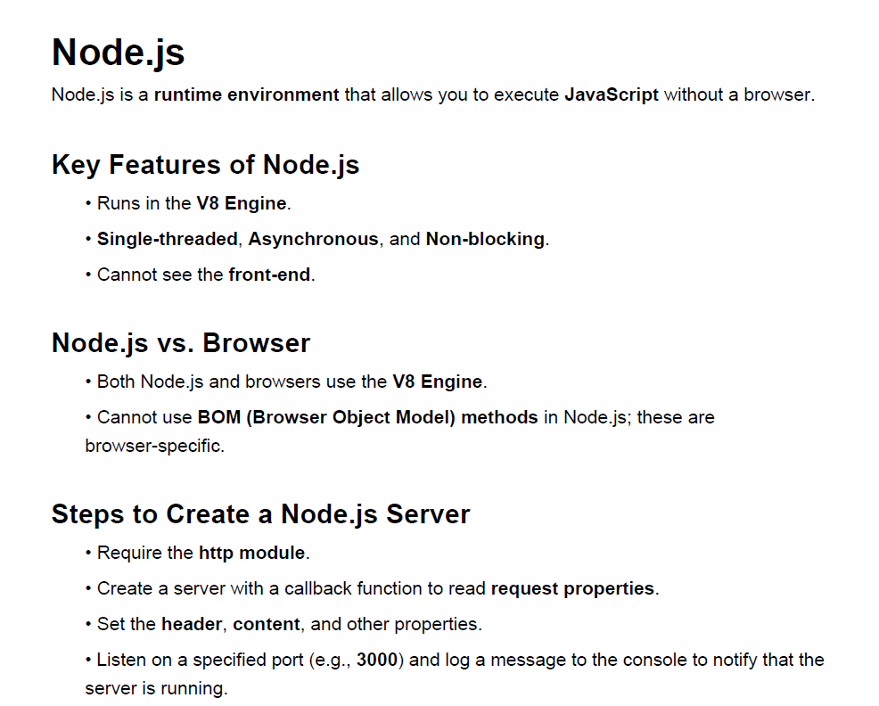

# 📝 Smart Notes AI: Handwriting-to-Textbook Transformer

**Smart Notes AI** is a full-stack application that transforms messy, handwritten lecture notes into structured, professional textbook-style documents. Using an **open-weight multimodal model** through **LangChain + Groq** and a **FastAPI/React** architecture, it does more than OCR: it interprets concepts, fixes technical terminology, and formats output into clean Markdown.

---

## 🔗 Project Deployment

| Service | Live Link |
| :--- | :--- |
| **Frontend UI** | [https://smart-notes-app-xzas.onrender.com/](https://smart-notes-app-xzas.onrender.com/) |
| **Backend API** | [https://smart-notes-backend-mue6.onrender.com/docs](https://smart-notes-backend-mue6.onrender.com/docs) |
---

## 🚀 Key Features

* **Open-Source AI Pipeline:** Uses LangChain orchestration with Groq-hosted open-weight models.
* **Multimodal Vision:** Reads and interprets handwritten notes directly from uploaded images.
* **Academic Enhancement:** Automatically corrects shorthand (e.g., "Nodes sv" becomes "Node.js Server").
* **Modern UI:** Features a glassmorphism design with a "Magic Wand" loading state for enhanced UX.
* **Live Preview:** Real-time Markdown rendering for instant review.
* **Textbook Formatting:** Outputs clean Markdown with structured headers, bold key terms, and bullet lists.

---

## 🛠️ Tech Stack

### **Frontend**
* **React + Vite:** For a blazing-fast, reactive user interface.
* **React-Markdown:** To render AI output into formatted textbook pages.
* **Lucide-React:** For modern, minimalist iconography.

### **Backend**
* **FastAPI (Python):** High-performance asynchronous API framework.
* **LangChain + ChatGroq:** Multimodal prompting and model invocation.
* **Open-weights Model:** `meta-llama/llama-4-scout-17b-16e-instruct` (or active Groq vision equivalent).
* **Uvicorn:** ASGI server for production-grade hosting.

---

## 📂 Project Structure

* **backend/**
    * `main.py` — FastAPI routes & AI Logic
    * `uploads/` — Temporary storage for note images
    * `requirements.txt` — Python dependencies
* **frontend/**
    * `src/App.jsx` — Main UI & API integration
    * `src/App.css` — Modern Glassmorphism styling
    * `package.json` — Node.js dependencies

---

## ⚙️ Installation & Setup

### **1. Clone the Repository**
* `git clone https://github.com/JeevithaPugazh/smart_notes_app.git`
* `cd smart_notes`

### **2. Backend Setup**
* Navigate to the backend: `cd backend`
* Create a `.env` file and add your API Key:
    * `GROQ_API_KEY=your_groq_api_key_here`
    * `GROQ_MODEL=meta-llama/llama-4-scout-17b-16e-instruct`
    * `PORT=8000`
* Install dependencies: `pip install -r requirements.txt`
* Run the server: `python -m uvicorn main:app --reload`

### **3. Frontend Setup**
* Navigate to the frontend: `cd ../frontend`
* Install dependencies: `npm install`
* Run the app: `npm run dev`

---

## 🤖 How the AI Model Works

The project uses a **Zero-Shot Multimodal Inference** approach:

1. **Image Encoding:** The handwritten image is converted to a base64 string for API transmission.
2. **Prompt Engineering:** The assistant prompt instructs the model to act as an *Academic Technical Editor*.
3. **Multimodal Input:** LangChain `HumanMessage` sends both prompt text and image data URL in one request.
4. **Contextual Correction:** Instead of raw OCR only, the model uses context to improve technical terms and readability.
5. **Markdown Synthesis:** The model returns clean Markdown, which is rendered in the frontend and saved to `backend/ocr_result.md`.

---

## ✅ Open-Source Migration Status

* Removed `google-generativeai` / Gemini usage from the backend pipeline.
* Replaced old Gemini functions with LangChain + `ChatGroq` image-to-markdown flow.
* Export routes (`/export/pdf`, `/export/docx`) now run through the same open-source AI flow.

---

## 📸 App Preview

### 🏗️ How it Works

## 🖼️ Gallery

| Upload Handwriting | AI Transformation |
| :--- | :--- |
|  |  |